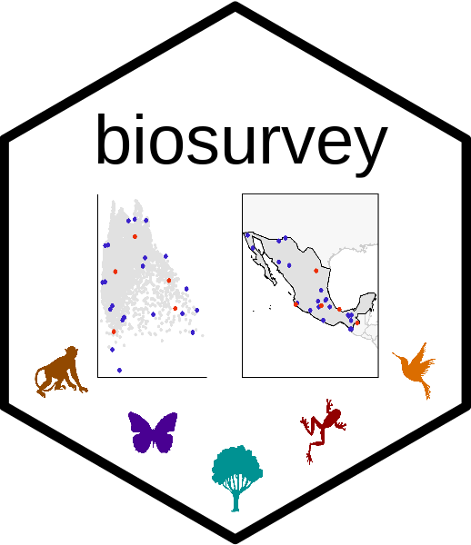
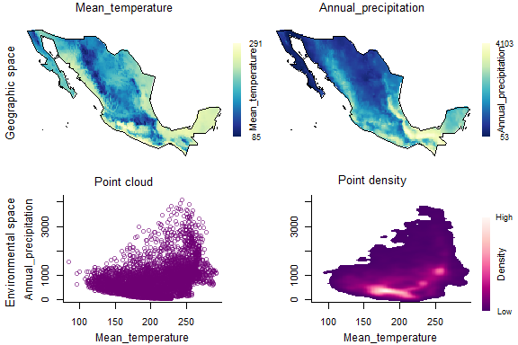
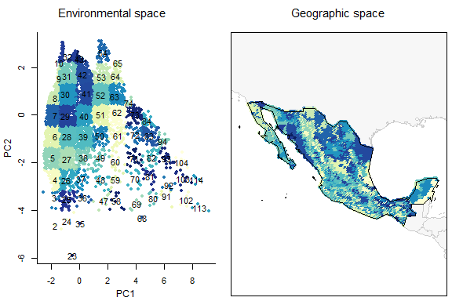

<hr>

</a>

```{r setup, include = FALSE}
knitr::opts_chunk$set(collapse = TRUE, comment = "#>", echo = FALSE)
```


### Description of data needed for analysis

The main goal of **biosurvey** is to help users to identify sites for biodiversity surveys. This package contain tools that use environmental and geographic information to promote the selection of sites that could allow a better sampling of species in a region. The types of data needed to perform analysis are:

- Spatial polygons (e.g., shapefiles) representing the region(s) of interest.
- Raster layers (e.g., GeoTiff, ASCII, and BIL) representing the environmental variables of interest.
- Spatial coordinates, spatial polygons, or raster layers representing species distribution ranges (optional, only used for tests).

The types of data mentioned above can be load in **R** using tools from packages like **raster**, **sp**, and **rgdal**. The classes of objects that you will need for using **biosurvey** are: 

- **RasterLayer**
- **RasterStack**
- **SpatialPolygonsDataFrame**
- **SpatialPolygonsDataFrame**
- Other basic objects from **R**, like **matrix**, **data.frame**, and **list**. 

The geographic projection of objects or coordinates involved in analyses must be WGS84 (EPSG:4326). Environmental and geographic information is all that is needed to select biodiversity survey sites (sampling sites). Information about species distribution is not required, but if it exists and is reliable, can be used to test the effectiveness of the sampling sites selected based on what is known about species richness in the region of interest.

<br>

### Example of how to prepare the data

#### Preparing an object that contains all information needed

The following lines of code help to prepare an S3 object (**master_matrix**) that will serve as the base to perform all further analyses. This object will contain: 1) *data_matrix*, with information about geographic location of raster cells, initial environmental data, and principal components derived from original data (PCs are optional); 2) an optional set of *preselected_sites*; 3) a spatial polygon representing the *region* of interest; 4) an optional *mask* to reduce the region of interest (to restrict it to natural areas, for instance); 5) a spatial object that serves as a *raster_base* to be used for plotting purposes; and 6) the *PCA_results*, if such analysis was used when constructing the **master_matrix**.

```{r prepare_master_matrix, eval=FALSE, echo=TRUE}
# Data
data("mx", package = "biosurvey")
variables <- raster::stack(system.file("extdata/variables.tif",
                                      package = "biosurvey"))
names(variables) <- c("Mean_temperature", "Max_temperature", "Min_temperature",
                      "Annual_precipitation", "Prec_wettest_month", 
                      "Prec_driest_month" )

# Create master matrix object
m_matrix <- prepare_master_matrix(region = mx, variables = variables, 
                                  do_pca = TRUE, center = TRUE, scale = TRUE)
#> Processing raster layers, please wait...
#> Performing PCA analysis

summary(m_matrix)
#> 
#>                      Summary of a master_matrix object
#> ---------------------------------------------------------------------------
#> 
#> Data matrix summary:
#>    Longitude          Latitude     Mean_temperature Max_temperature
#>  Min.   :-116.92   Min.   :14.58   Min.   : 85.0    Min.   :180    
#>  1st Qu.:-106.79   1st Qu.:19.92   1st Qu.:174.0    1st Qu.:309    
#>  Median :-102.58   Median :24.25   Median :203.0    Median :335    
#>  Mean   :-102.52   Mean   :23.95   Mean   :203.6    Mean   :330    
#>  3rd Qu.: -98.75   3rd Qu.:27.92   3rd Qu.:236.0    3rd Qu.:354    
#>  Max.   : -86.92   Max.   :32.58   Max.   :291.0    Max.   :425    
#>  Min_temperature  Annual_precipitation Prec_wettest_month Prec_driest_month
#>  Min.   :-60.00   Min.   :  53.0       Min.   :  9.0      Min.   :  0.00   
#>  1st Qu.: 30.00   1st Qu.: 352.0       1st Qu.: 78.0      1st Qu.:  3.00   
#>  Median : 60.00   Median : 619.0       Median :144.5      Median :  6.00   
#>  Mean   : 70.66   Mean   : 768.8       Mean   :164.7      Mean   : 10.67   
#>  3rd Qu.:112.00   3rd Qu.:1046.2       3rd Qu.:224.0      3rd Qu.: 12.00   
#>  Max.   :213.00   Max.   :4103.0       Max.   :750.0      Max.   :140.00   
#>       PC1               PC2         
#>  Min.   :-2.5770   Min.   :-5.9018  
#>  1st Qu.:-1.3957   1st Qu.:-0.7861  
#>  Median :-0.6003   Median : 0.1946  
#>  Mean   : 0.0000   Mean   : 0.0000  
#>  3rd Qu.: 1.0825   3rd Qu.: 0.9541  
#>  Max.   : 9.1506   Max.   : 3.1070  
#> 
#> 
#> No preselected sites were defined
#> 
#> 
#> Region of interest:
#> class       : SpatialPolygonsDataFrame 
#> features    : 1 
#> extent      : -118.4042, -86.7014, 14.55055, 32.71846  (xmin, xmax, ymin, ymax)
#> crs         : +proj=longlat +datum=WGS84 +no_defs 
#> variables   : 11
#> names       : FIPS, ISO2, ISO3,  UN,   NAME,   AREA,   POP2005, REGION, SUBREGION,      LON,    LAT 
#> value       :   MX,   MX,  MEX, 484, Mexico, 190869, 104266392,     19,        13, -102.535, 23.951

```

<br>

If you want to define points that need to be included in the final selection of sites to be sampled, you can do it by adding them as a `data.frame` in one of the arguments of the function `prepare_master_matrix`. See below:

```{r prepare_master_matrix1, eval=FALSE, echo=TRUE}
# preselected site example
data("preselected", package = "biosurvey")

# Create master matrix object
m_matrix_pre <- prepare_master_matrix(region = mx, variables = variables, 
                                      preselected_sites = preselected,  
                                      do_pca = TRUE, center = TRUE, scale = TRUE)
#> Processing raster layers, please wait...
#> Performing PCA analysis

summary(m_matrix_pre)
#> 
#>                      Summary of a master_matrix object
#> ---------------------------------------------------------------------------
#> 
#> Data matrix summary:
#>    Longitude          Latitude     Mean_temperature Max_temperature
#>  Min.   :-116.92   Min.   :14.58   Min.   : 85.0    Min.   :180    
#>  1st Qu.:-106.79   1st Qu.:19.92   1st Qu.:174.0    1st Qu.:309    
#>  Median :-102.58   Median :24.25   Median :203.0    Median :335    
#>  Mean   :-102.52   Mean   :23.95   Mean   :203.6    Mean   :330    
#>  3rd Qu.: -98.75   3rd Qu.:27.92   3rd Qu.:236.0    3rd Qu.:354    
#>  Max.   : -86.92   Max.   :32.58   Max.   :291.0    Max.   :425    
#>  Min_temperature  Annual_precipitation Prec_wettest_month Prec_driest_month
#>  Min.   :-60.00   Min.   :  53.0       Min.   :  9.0      Min.   :  0.00   
#>  1st Qu.: 30.00   1st Qu.: 352.0       1st Qu.: 78.0      1st Qu.:  3.00   
#>  Median : 60.00   Median : 619.0       Median :144.5      Median :  6.00   
#>  Mean   : 70.66   Mean   : 768.8       Mean   :164.7      Mean   : 10.67   
#>  3rd Qu.:112.00   3rd Qu.:1046.2       3rd Qu.:224.0      3rd Qu.: 12.00   
#>  Max.   :213.00   Max.   :4103.0       Max.   :750.0      Max.   :140.00   
#>       PC1               PC2         
#>  Min.   :-2.5770   Min.   :-5.9018  
#>  1st Qu.:-1.3957   1st Qu.:-0.7861  
#>  Median :-0.6003   Median : 0.1946  
#>  Mean   : 0.0000   Mean   : 0.0000  
#>  3rd Qu.: 1.0825   3rd Qu.: 0.9541  
#>  Max.   : 9.1506   Max.   : 3.1070  
#> 
#> 
#> Sites preselected by user:
#>                Site  Longitude Latitude
#> 1           Chamela -105.04479 19.50090
#> 2       Los Tuxtlas  -95.07419 18.58489
#> 3            Chajul  -90.94067 16.17000
#> 4 Parque de Tlalpan  -99.19778 19.29139
#> 5  Parque Chipinque -100.35940 25.61750
#> 
#> 
#> Region of interest:
#> class       : SpatialPolygonsDataFrame 
#> features    : 1 
#> extent      : -118.4042, -86.7014, 14.55055, 32.71846  (xmin, xmax, ymin, ymax)
#> crs         : +proj=longlat +datum=WGS84 +no_defs 
#> variables   : 11
#> names       : FIPS, ISO2, ISO3,  UN,   NAME,   AREA,   POP2005, REGION, SUBREGION,      LON,    LAT 
#> value       :   MX,   MX,  MEX, 484, Mexico, 190869, 104266392,     19,        13, -102.535, 23.951

```

<br>

#### Exploring your data in environmental and geographic spaces

The data can be explored by creating four-panel plots using two environmental variables (at a time). The two top panels contain the information in geographic space (one predictor per panel). The two panels at the bottom contain information in a 2D environmental space for the two variables.

```{r explore_data_EG, eval=FALSE, echo=TRUE}
# Plot using environmental variables
explore_data_EG(m_matrix, variable_1 = "Mean_temperature", 
                variable_2 = "Annual_precipitation")
```

```{r, fig.height=4, fig.width=6}

```

<br>

Now let's use the principal components that summarize most of the variance in your variables.

```{r explore_data_EG1, eval=FALSE, echo=TRUE}
# Plot using Principal Components resulted
explore_data_EG(m_matrix, variable_1 = "PC1", variable_2 = "PC2")
```

```{r, fig.height=4, fig.width=6}
knitr::include_graphics("vignette_img/V1f2.png")
```

<br>

#### Partitioning environmental space to achieve uniformity in selections

Block-like partitioning of environmental space. Here, a two-dimensional cloud of points will be blocked according to a user-defined number of rows and columns. These will allow us to see the environmental space more uniformly.

```{r make_blocks, eval=FALSE, echo=TRUE}
# Creating blocks
m_blocks <- make_blocks(m_matrix, variable_1 = "PC1",
                       variable_2 = "PC2", n_cols = 10, n_rows = 10,
                       block_type = "equal_area")
unique(m_blocks$data_matrix$Block)
#>  [1]   7   9  32   6  31  10   5   8  30   4  29  28   3  42  27  41  40  39  26
#> [20]  43  38  52  25  51  37  36  53  50  62  61  73  71  72  63  49  59  60  48
#> [39]  70  64  58  81  80  91  47  68  35  54  24   2  23  82  74  83  92  93  84
#> [58]  69 102 103  94 104 114 113  65

```

<br>

Let's check how the blocked environment looks like in environmental and geographic spaces.

```{r plot_blocks_EG, eval=FALSE, echo=TRUE}
# plotting all blocks
plot_blocks_EG(master = m_blocks, variable_1 = "PC1", variable_2 = "PC2",
               block_ID = TRUE)

```

```{r, fig.height=4, fig.width=6}

```
