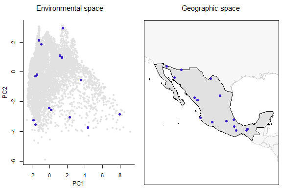
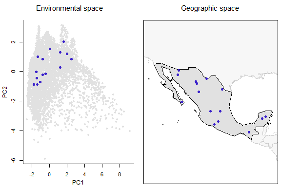
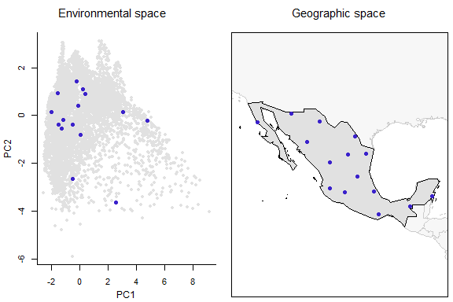
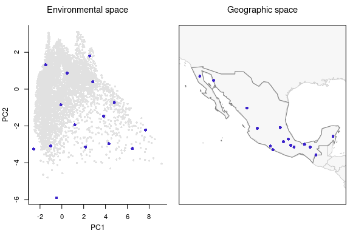

```{r setup, include = FALSE}
knitr::opts_chunk$set(collapse = TRUE, comment = "#>", echo = FALSE)
```

#### Data for analysis

Let's first prepare the data to continue with further processes.

```{r data, eval=FALSE, echo=TRUE}
# Data
data("m_matrix", package = "biosurvey")

# Creating blocks
m_blocks <- make_blocks(m_matrix, variable_1 = "PC1",
                       variable_2 = "PC2", n_cols = 20, n_rows = 20,
                       block_type = "equal_area")
```

<br>

#### Selection of sites considering environmental uniformity and geographic patterns

The goal of this type of selection is maximizing uniformity of points in environmental space, but considering geographic patterns of data. Similar environments (form the same block) that have a disjoint geographic pattern (are represented in geographic in various clusters) are selected twice (so they consider the biggest geographic clusters).


```{r EG_selection, eval=FALSE, echo=TRUE}
# Selecting sites uniformly in E and G spaces
EG_sel <- EG_selection(master = m_blocks, n_blocks = 10)

#> Element 'preselected_sites' in 'master' is NULL, setting
#> 'use_preselected_sites' = FALSE
#> Preparing data for analysis
#> Selecting relevant environmental blocks, please wait...
#> Running algorithm for selecting sites, please wait...
#>     Process 1 of 10
#>     Process 2 of 10
#>     Process 3 of 10
#>     Process 4 of 10
#>     Process 5 of 10
#>     Process 6 of 10
#>     Process 7 of 10
#>     Process 8 of 10
#>     Process 9 of 10
#>     Process 10 of 10
#> Total number of sites selected: 15
```

<br>

Now let's check the results of this selection in environmental and geographic spaces. 

```{r plot_sites_EG EG, eval=FALSE, echo=TRUE, fig.height=4, fig.width=6}
# Plotting sites selected considering EG
plot_sites_EG(EG_sel, selection_type = "EG")
```

```{r, fig.height=4, fig.width=6}

```

<br>

As you may have noticed, there are more points than what you defined in the argument *n_blocks* in the function `EG_selection`. This is because the function explores those environmental blocks in geographic space and defines two points when the geographic pattern of such points is clustered.

<br>

#### Selecting sites randomly

Selecting survey sites randomly is one of the multiple ways to select places to sample. Although it can be useful for avoiding some biases in the selection, it is not recommended  when trying to sample most of the biodiversity in a region. The following lines of code will allow users to select survey sites based on a random selection of available points. This selection approach does not consider geographic or environmental configurations.

**Note**: We are going to use the object that resulted from the previous process of selection (a **master_selection** object) as it allows to add other sets of selected sites to maintain your results organized. 

```{r random_selection, eval=FALSE, echo=TRUE}
# Number of sites
nsites <- nrow(EG_sel$selected_sites_EG$selection_1)

# Selecting sites randomly
EG_r_selection <- random_selection(EG_sel, n_sites = nsites, n_samplings = 5)

#> Element 'preselected_sites' in 'master' is NULL, setting
#> 'use_preselected_sites' = FALSE
#> Selecting sampling sites randomly
#> Total number of sites selected: 15
```

<br>

Checking the sites selected randomly. Note that for selections of type "random" or "G" the arguments "variable_1" and "variable_2" need to be defined in the plotting function.

```{r plot_sites_EG random, eval=FALSE, echo=TRUE, fig.height=4, fig.width=6}
# Plotting selected sites
plot_sites_EG(EG_r_selection, selection_type = "random", variable_1 = "PC1", 
              variable_2 = "PC2")
```

```{r, fig.height=4, fig.width=6}

```

<br>

#### Selection of sites aiming for uniformity in geographic space

With the following lines of code, survey sites can be selected so they are located uniformly in geographic space, without considering environmental conditions. This allows sampling most of the areas in the region of interest.

```{r uniformG_selection, eval=FALSE, echo=TRUE}
# Selecting sites uniformly in G space
EG_r_G_selection <- uniformG_selection(EG_r_selection, expected_points = nsites, 
                                       max_n_samplings = 1, replicates = 5)

#> Element 'preselected_sites' in 'master' is NULL, setting
#> 'use_preselected_sites' = FALSE
#> Running algorithm for selecting sites, please wait...
#>     Distance  242.166565850223  resulted in  17  points
#>     Distance  266.383222435246  resulted in  13  points
#>     Distance  242.166565850223  resulted in  17  points
#>     Distance  244.588231508726  resulted in  17  points
#>     Distance  247.009897167228  resulted in  16  points
#>     Distance  249.43156282573  resulted in  16  points
#>     Distance  251.853228484232  resulted in  15  points
#> Total number of sites selected: 15
```

<br>

Let's check the selected sites based only on geographic considerations.

```{r plot_sites_EG G_selection, eval=FALSE, echo=TRUE, fig.height=4, fig.width=6}
# Plotting sites selected uniformly in the geographic space
plot_sites_EG(EG_r_G_selection, selection_type = "G", variable_1 = "PC1", 
              variable_2 = "PC2")
```

```{r, fig.height=4, fig.width=6}

```

<br>

#### Selecting sites aiming for uniformity in environmental space

With the following lines of code you can select sampling sites that are uniformly distributed in environmental space. This will allow sampling most of the environmental conditions that are present in the region of interest.

```{r uniformE_selection_blocks, eval=FALSE, echo=TRUE}
# Selecting sites uniformly in E space
EG_r_G_E_selection <- uniformE_selection(EG_r_G_selection, expected_points = nsites, 
                                         max_n_samplings = 1, replicates = 5)

#> Element 'preselected_sites' in 'master' is NULL, setting
#> 'use_preselected_sites' = FALSE
#> Running algorithm for selecting sites, please wait...
#>     Distance  0.985888853481237  resulted in  25  points
#>     Distance  1.08447773882936  resulted in  20  points
#>     Distance  1.18306662417748  resulted in  17  points
#>     Distance  1.28165550952561  resulted in  14  points
#>     Distance  1.18306662417748  resulted in  17  points
#>     Distance  1.1929255127123  resulted in  17  points
#>     Distance  1.20278440124711  resulted in  16  points
#>     Distance  1.21264328978192  resulted in  15  points
#> Total number of sites selected: 15
```

<br>

Let's check the selected sites based only on environmental considerations.

```{r plot_sites_EG E_all, eval=FALSE, echo=TRUE, fig.height=4, fig.width=6}
# Plotting sites selected uniformly in the environmental space
plot_sites_EG(EG_r_G_E_selection, selection_type = "E")
```

```{r, fig.height=4, fig.width=6}

```
