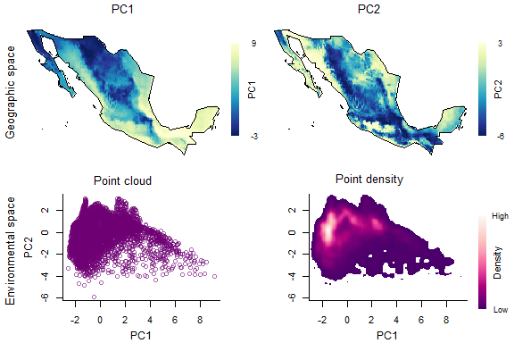
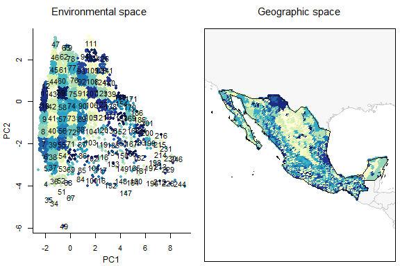
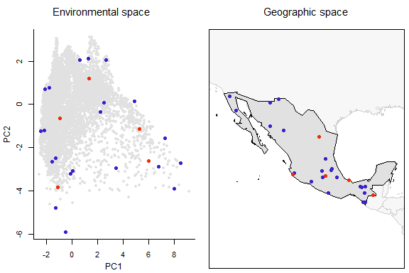
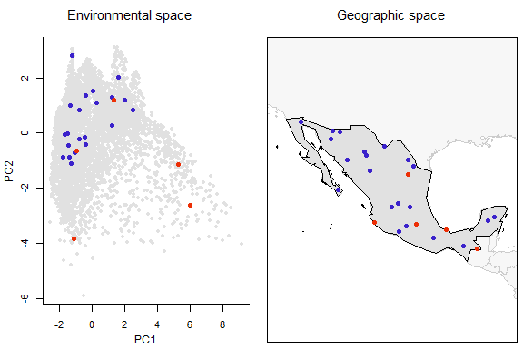
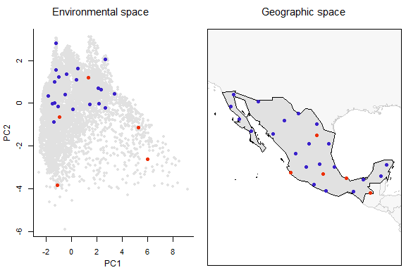
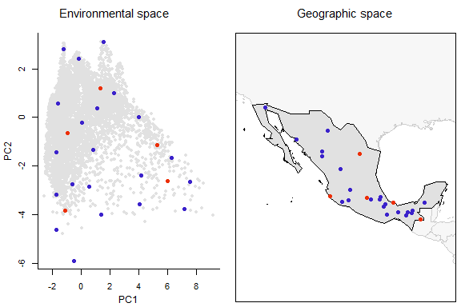

```{r setup, include = FALSE}
knitr::opts_chunk$set(collapse = TRUE, comment = "#>", echo = FALSE)
```

#### Data for analysis

Let's first prepare the data to continue with further processes.

```{r prepare_master_matrix, eval=FALSE, echo=TRUE}
# Data
data("mx", package = "biosurvey")
data("preselected", package = "biosurvey")
variables <- raster::stack(system.file("extdata/variables.tif",
                                      package = "biosurvey"))
names(variables) <- c("Mean_temperature", "Max_temperature",  "Min_temperature",
                      "Annual_precipitation", "Prec_wettest_month",
                      "Prec_driest_month")

# Create master matrix object
m_matrixp <- prepare_master_matrix(region = mx, variables = variables, 
                                  preselected_sites = preselected, 
                                  do_pca = TRUE, center = TRUE, scale = TRUE)
#> Processing raster layers, please wait...
#> Performing PCA analysis

summary(m_matrixp)
#> 
#>                      Summary of a master_matrix object
#> ---------------------------------------------------------------------------
#> 
#> Data matrix summary:
#>    Longitude          Latitude     Mean_temperature Max_temperature
#>  Min.   :-116.92   Min.   :14.58   Min.   : 85.0    Min.   :180    
#>  1st Qu.:-106.79   1st Qu.:19.92   1st Qu.:174.0    1st Qu.:309    
#>  Median :-102.58   Median :24.25   Median :203.0    Median :335    
#>  Mean   :-102.52   Mean   :23.95   Mean   :203.6    Mean   :330    
#>  3rd Qu.: -98.75   3rd Qu.:27.92   3rd Qu.:236.0    3rd Qu.:354    
#>  Max.   : -86.92   Max.   :32.58   Max.   :291.0    Max.   :425    
#>  Min_temperature  Annual_precipitation Prec_wettest_month Prec_driest_month
#>  Min.   :-60.00   Min.   :  53.0       Min.   :  9.0      Min.   :  0.00   
#>  1st Qu.: 30.00   1st Qu.: 352.0       1st Qu.: 78.0      1st Qu.:  3.00   
#>  Median : 60.00   Median : 619.0       Median :144.5      Median :  6.00   
#>  Mean   : 70.66   Mean   : 768.8       Mean   :164.7      Mean   : 10.67   
#>  3rd Qu.:112.00   3rd Qu.:1046.2       3rd Qu.:224.0      3rd Qu.: 12.00   
#>  Max.   :213.00   Max.   :4103.0       Max.   :750.0      Max.   :140.00   
#>       PC1               PC2         
#>  Min.   :-2.5770   Min.   :-5.9018  
#>  1st Qu.:-1.3957   1st Qu.:-0.7861  
#>  Median :-0.6003   Median : 0.1946  
#>  Mean   : 0.0000   Mean   : 0.0000  
#>  3rd Qu.: 1.0825   3rd Qu.: 0.9541  
#>  Max.   : 9.1506   Max.   : 3.1070  
#> 
#> 
#> Sites preselected by user:
#>                Site  Longitude Latitude
#> 1           Chamela -105.04479 19.50090
#> 2       Los Tuxtlas  -95.07419 18.58489
#> 3            Chajul  -90.94067 16.17000
#> 4 Parque de Tlalpan  -99.19778 19.29139
#> 5  Parque Chipinque -100.35940 25.61750
#> 
#> 
#> Region of interest:
#> class       : SpatialPolygonsDataFrame 
#> features    : 1 
#> extent      : -118.4042, -86.7014, 14.55055, 32.71846  (xmin, xmax, ymin, ymax)
#> crs         : +proj=longlat +datum=WGS84 +no_defs 
#> variables   : 11
#> names       : FIPS, ISO2, ISO3,  UN,   NAME,   AREA,   POP2005, REGION, SUBREGION,      LON,    LAT 
#> value       :   MX,   MX,  MEX, 484, Mexico, 190869, 104266392,     19,        13, -102.535, 23.951
```

<br>

#### Exploring your data in environmental and geographic spaces

The data can be explored by creating four-panel plots using two environmental variables (at a time). The two top panels contain the information in geographic space (one predictor per panel). The two panels at the bottom contain information in a 2D environmental space for the two variables. This visualization can be done using the first two principal components that summarize most of the variance in your variables as shown below.

```{r explore_data_EG, eval=FALSE, echo=TRUE}
# Plot using Principal Components resulted
explore_data_EG(m_matrixp, variable_1 = "PC1", variable_2 = "PC2")

```

```{r, fig.height=4, fig.width=6}

```

<br>

#### Partitioning environmental space to achieve uniformity in selections

Block-like partitioning of environmental space. Here, a two-dimensional cloud of points will be blocked according to a user-defined number of rows and columns. These will allow us to see the environmental space more uniformly.

```{r make_blocks, eval=FALSE, echo=TRUE}
# Creating blocks
m_blocks <- make_blocks(m_matrixp, variable_1 = "PC1",
                       variable_2 = "PC2", n_cols = 15, n_rows = 15,
                       block_type = "equal_area")

```

<br>

Let's check how the blocked environment looks like in environmental and geographic spaces.

```{r plot_blocks_EG, eval=FALSE, echo=TRUE}
# plotting all blocks
plot_blocks_EG(master = m_blocks, block_ID = TRUE)
```

```{r, fig.height=4, fig.width=6}

```

<br>

### Selection of sampling sites based on distinct methods

The common goal of the following processes is to select sites to be sampled, but always including the preselected sites as part of the set of points selected. 

<br>

#### Selection of sites considering environmental uniformity and geographic patterns

The goal of this type of selection is maximizing uniformity of points in environmental space, but considering geographic patterns of data. Similar environments (form the same block) that have a disjoint geographic pattern (are represented in geographic in various clusters) are selected twice (so they consider the biggest geographic clusters).

```{r EG_selection, eval=FALSE, echo=TRUE}
# Selecting sites uniformly in E and G spaces
EG_sel <- EG_selection(master = m_blocks, n_blocks = 20)
#> Preparing data for analysis
#> Running distance optimization, please wait...
#> Selecting relevant environmental blocks, please wait...
#> Running algorithm for selecting sites, please wait...
#>     Process 1 of 10
#>     Process 2 of 10
#>     Process 3 of 10
#>     Process 4 of 10
#>     Process 5 of 10
#>     Process 6 of 10
#>     Process 7 of 10
#>     Process 8 of 10
#>     Process 9 of 10
#>     Process 10 of 10
#> Total number of sites selected: 26

summary(EG_sel)
#> 
#>                   Summary of a master_selection object
#> ---------------------------------------------------------------------------
#> 
#> Sites preselected by user:
#>                Site  Longitude Latitude
#> 1           Chamela -105.04479 19.50090
#> 2       Los Tuxtlas  -95.07419 18.58489
#> 3            Chajul  -90.94067 16.17000
#> 4 Parque de Tlalpan  -99.19778 19.29139
#> 5  Parque Chipinque -100.35940 25.61750
#> 
#> 
#> 2 columns and 6 rows of first elements are shown
#> 
#> Sites selected randomly:
#> Empty
#> 
#> 
#> Sites selected uniformly in G space:
#> Empty
#> 
#> 
#> Sites selected uniformly in E space:
#> Empty
#> 
#> 
#> Sites selected uniformly in E space, considering G structure:
#>       Longitude Latitude
#> 1    -105.04479 19.50090
#> 2     -95.07419 18.58489
#> 3     -90.94067 16.17000
#> 4     -99.19778 19.29139
#> 5    -100.35940 25.61750
#> 4477  -98.08333 20.41667

```

<br>

Now let's check the results of this selection in environmental and geographic spaces. In this and future plots of selected sites, user preselected sites will be plotted in red.

```{r plot_sites_EG EG, eval=FALSE, echo=TRUE}
# Plotting sites selected uniformly in the geographic and in the environmental spaces
plot_sites_EG(EG_sel, selection_type = "EG")
```

```{r, fig.height=4, fig.width=6}

```

<br>

As you may have noticed, there are more points than what you defined in the argument *n_blocks* in the function `EG_selection`. This is because the function explores those environmental blocks in geographic space and defines two points when the geographic pattern of such points is clustered.

<br>

#### Selecting sites randomly

Selecting survey sites randomly is one of the multiple ways to select places to sample. Although it can be useful for avoiding some biases in the selection, it is not recommended  when trying to sample most of the biodiversity in a region. The following lines of code will allow users to select survey sites based on a random selection of available points. This selection approach does not consider geographic or environmental configurations.

**Note**: We are going to use the object that resulted from the previous process of selection (a **master_selection** object) as it allows to add other sets of selected sites to maintain your results organized. 

```{r random_selection, eval=FALSE, echo=TRUE}
# Selecting sites randomly
EG_r_selection <- random_selection(EG_sel, n_sites = 26, n_samplings = 5)
#> Selecting sampling sites randomly
#> Total number of sites selected: 26

summary(EG_r_selection)
#> 
#>                   Summary of a master_selection object
#> ---------------------------------------------------------------------------
#> 
#> Sites preselected by user:
#>                Site  Longitude Latitude
#> 1           Chamela -105.04479 19.50090
#> 2       Los Tuxtlas  -95.07419 18.58489
#> 3            Chajul  -90.94067 16.17000
#> 4 Parque de Tlalpan  -99.19778 19.29139
#> 5  Parque Chipinque -100.35940 25.61750
#> 
#> 
#> 2 columns and 6 rows of first elements are shown
#> 
#> Sites selected randomly:
#>       Longitude Latitude
#> 1    -105.04479 19.50090
#> 2     -95.07419 18.58489
#> 3     -90.94067 16.17000
#> 4     -99.19778 19.29139
#> 5    -100.35940 25.61750
#> 1017 -103.58333 29.08333
#> 
#> 
#> Sites selected uniformly in G space:
#> Empty
#> 
#> 
#> Sites selected uniformly in E space:
#> Empty
#> 
#> 
#> Sites selected uniformly in E space, considering G structure:
#>       Longitude Latitude
#> 1    -105.04479 19.50090
#> 2     -95.07419 18.58489
#> 3     -90.94067 16.17000
#> 4     -99.19778 19.29139
#> 5    -100.35940 25.61750
#> 4477  -98.08333 20.41667
```

<br>

Checking the sites selected randomly.

```{r plot_sites_EG random, eval=FALSE, echo=TRUE}
# Plotting randomly selected sites
plot_sites_EG(EG_r_selection, selection_type = "random", variable_1 = "PC1", 
              variable_2 = "PC2")
```

```{r, fig.height=4, fig.width=6}

```

<br>

#### Selection of sites aiming for uniformity in geographic space

With the following lines of code, survey sites can be selected so they are located uniformly in geographic space, without considering environmental conditions. This allows sampling most of the areas in the region of interest.

```{r uniformG_selection, eval=FALSE, echo=TRUE}
# Selecting sites uniformly in G space
EG_r_G_selection <- uniformG_selection(EG_r_selection, expected_points = 26)
#> Running distance optimization, please wait...
#> Running algorithm for selecting sites, please wait...
#>     Distance  181.62  resulted in  30  points
#>     Distance  199.782  resulted in  24  points
#>     Distance  217.944  resulted in  23  points
#>     Distance  236.106  resulted in  20  points
#>     Distance  217.944  resulted in  23  points
#>     Distance  219.7602  resulted in  22  points
#>     Distance  221.5764  resulted in  22  points
#>     Distance  223.3926  resulted in  22  points
#>     Distance  225.2088  resulted in  22  points
#>     Distance  227.025  resulted in  22  points
#>     Distance  228.8412  resulted in  20  points
#>     Distance  227.025  resulted in  22  points
#>     Distance  227.20662  resulted in  22  points
#>     Distance  227.38824  resulted in  21  points
#> Total number of sites selected: 26

summary(EG_r_G_selection)
#> 
#>                   Summary of a master_selection object
#> ---------------------------------------------------------------------------
#> 
#> Sites preselected by user:
#>                Site  Longitude Latitude
#> 1           Chamela -105.04479 19.50090
#> 2       Los Tuxtlas  -95.07419 18.58489
#> 3            Chajul  -90.94067 16.17000
#> 4 Parque de Tlalpan  -99.19778 19.29139
#> 5  Parque Chipinque -100.35940 25.61750
#> 
#> 
#> 2 columns and 6 rows of first elements are shown
#> 
#> Sites selected randomly:
#>       Longitude Latitude
#> 1    -105.04479 19.50090
#> 2     -95.07419 18.58489
#> 3     -90.94067 16.17000
#> 4     -99.19778 19.29139
#> 5    -100.35940 25.61750
#> 1017 -103.58333 29.08333
#> 
#> 
#> Sites selected uniformly in G space:
#>       Longitude Latitude
#> 1    -105.04479 19.50090
#> 2     -95.07419 18.58489
#> 3     -90.94067 16.17000
#> 4     -99.19778 19.29139
#> 5    -100.35940 25.61750
#> 1017 -103.58333 29.08333
#> 
#> 
#> Sites selected uniformly in E space:
#> Empty
#> 
#> 
#> Sites selected uniformly in E space, considering G structure:
#>       Longitude Latitude
#> 1    -105.04479 19.50090
#> 2     -95.07419 18.58489
#> 3     -90.94067 16.17000
#> 4     -99.19778 19.29139
#> 5    -100.35940 25.61750
#> 4477  -98.08333 20.41667

```

<br>

Let's check the selected sites based only on geographic considerations.

```{r plot_sites_EG G_selection, eval=FALSE, echo=TRUE}
# Plotting sites selected uniformly in the geographic space
plot_sites_EG(EG_r_G_selection, selection_type = "G", variable_1 = "PC1", 
              variable_2 = "PC2")
```

```{r, fig.height=4, fig.width=6}

```

<br>

#### Selecting sites aiming for uniformity in environmental space

With the following lines of code you can select sampling sites that are uniformly distributed in environmental space. This will allow sampling most of the environmental conditions that are present in the region of interest.

```{r uniformE_selection, eval=FALSE, echo=TRUE}
# Selecting sites uniformly in E space
EG_r_G_E_selection <- uniformE_selection(EG_r_G_selection, expected_points = 26)
#> Running distance optimization, please wait...
#> Running algorithm for selecting sites, please wait...
#>     Distance  0.81  resulted in  35  points
#>     Distance  0.891  resulted in  29  points
#>     Distance  0.972  resulted in  27  points
#>     Distance  1.053  resulted in  22  points
#>     Distance  1.134  resulted in  20  points
#>     Distance  1.053  resulted in  22  points
#>     Distance  1.0611  resulted in  22  points
#>     Distance  1.0692  resulted in  22  points
#>     Distance  1.0773  resulted in  22  points
#>     Distance  1.0854  resulted in  22  points
#>     Distance  1.0935  resulted in  22  points
#>     Distance  1.1016  resulted in  20  points
#>     Distance  1.0935  resulted in  22  points
#>     Distance  1.09431  resulted in  22  points
#>     Distance  1.09512  resulted in  21  points
#> Total number of sites selected: 26

summary(EG_r_G_E_selection)
#> 
#>                   Summary of a master_selection object
#> ---------------------------------------------------------------------------
#> 
#> Sites preselected by user:
#>                Site  Longitude Latitude
#> 1           Chamela -105.04479 19.50090
#> 2       Los Tuxtlas  -95.07419 18.58489
#> 3            Chajul  -90.94067 16.17000
#> 4 Parque de Tlalpan  -99.19778 19.29139
#> 5  Parque Chipinque -100.35940 25.61750
#> 
#> 
#> 2 columns and 6 rows of first elements are shown
#> 
#> Sites selected randomly:
#>       Longitude Latitude
#> 1    -105.04479 19.50090
#> 2     -95.07419 18.58489
#> 3     -90.94067 16.17000
#> 4     -99.19778 19.29139
#> 5    -100.35940 25.61750
#> 1017 -103.58333 29.08333
#> 
#> 
#> Sites selected uniformly in G space:
#>       Longitude Latitude
#> 1    -105.04479 19.50090
#> 2     -95.07419 18.58489
#> 3     -90.94067 16.17000
#> 4     -99.19778 19.29139
#> 5    -100.35940 25.61750
#> 1017 -103.58333 29.08333
#> 
#> 
#> Sites selected uniformly in E space:
#>       Longitude Latitude
#> 1    -105.04479 19.50090
#> 2     -95.07419 18.58489
#> 3     -90.94067 16.17000
#> 4     -99.19778 19.29139
#> 5    -100.35940 25.61750
#> 1081 -105.41667 28.91667
#> 
#> 
#> Sites selected uniformly in E space, considering G structure:
#>       Longitude Latitude
#> 1    -105.04479 19.50090
#> 2     -95.07419 18.58489
#> 3     -90.94067 16.17000
#> 4     -99.19778 19.29139
#> 5    -100.35940 25.61750
#> 4477  -98.08333 20.41667
```

<br>

Let's check the selected sites based only on environmental considerations.

```{r plot_sites_EG E_all, eval=FALSE, echo=TRUE}
# Plotting sites selected uniformly in the environmental space
plot_sites_EG(EG_r_G_E_selection, selection_type = "E")
```

```{r, fig.height=4, fig.width=6}

```

