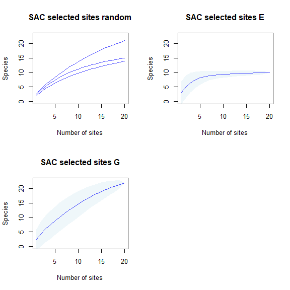
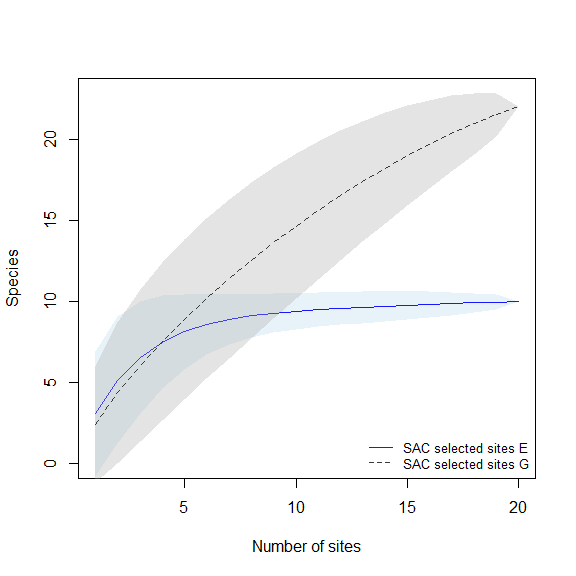
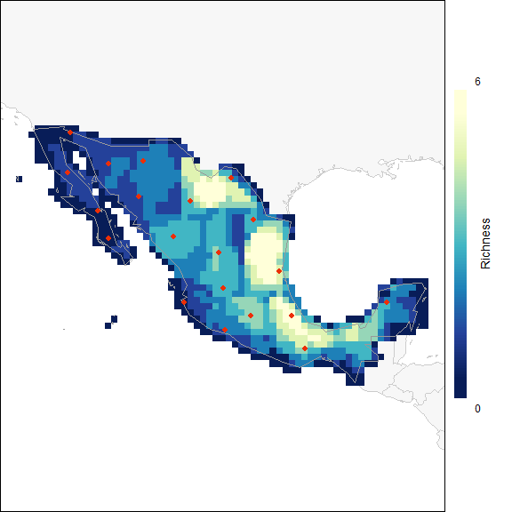
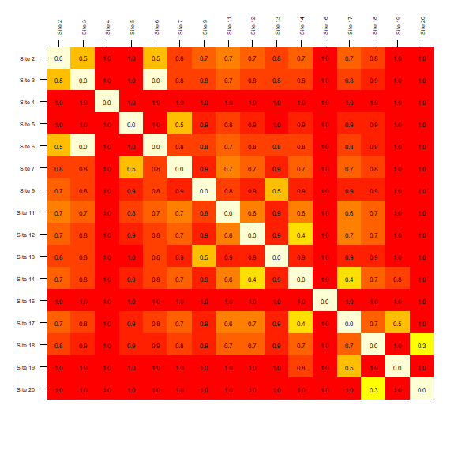
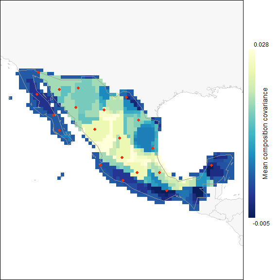
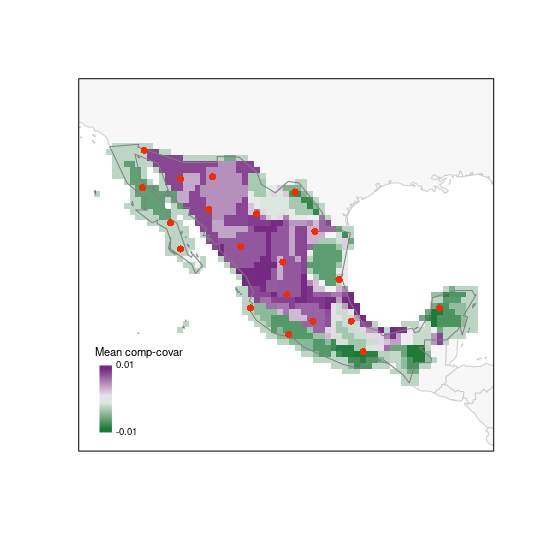

```{r setup, include = FALSE}
knitr::opts_chunk$set(collapse = TRUE, comment = "#>", echo = FALSE)
```

### Description

Before we start, we would like to clarify that the examples used here are for demonstration purposes only. The functions in the testing module of this package are intended to use when appropriate data is available. This is, a considerable amount of data, of good quality, is needed to produce a presence-absence matrix to have a good representation of biodiversity in a region. For these reasons, we recommend to use these functions with caution and only when appropriate.

<br>

### Preparing data to test efficiency of selected sites

#### Preparing presence-absence matrix

With the following lines of code we are going to prepare a presence-absence matrix (PAM) in which all initial points of interest (rows) will have a representation of presence or absence of the species in such areas (as columns). The initial points of interest will be represented by an ID, and longitude and latitude coordinates. The result of this process is a **base_PAM** object that will be used in further processes.

```{r preare_base_PAM, eval=FALSE, echo=TRUE}
# Data
data("species_data", package = "biosurvey")

# Create base_pam
b_pam <- prepare_base_PAM(data = species_data, master_matrix = m_matrix, 
                          cell_size = 50)
#> Preparing spatial grid
#> Preprocessing 'data'
#> |======================================================================| 100%
#> Preparing PAM from information
#> Calculating PAM indices

summary(b_pam)
#> 
#>                       Summary of a base_PAM object
#> ---------------------------------------------------------------------------
#> 
#> Presence-absence matrix:
#>   Number of cells:    1020
#>   Number of species:  25
#> 
#> Spatial object representing the PAM:
#> class       : SpatialPolygonsDataFrame 
#> features    : 1020 
#> extent      : -118.4298, -86.51483, 14.28854, 32.77954  (xmin, xmax, ymin, ymax)
#> crs         : +proj=longlat +datum=WGS84 +no_defs 
#> variables   : 28
#> names       :   ID,         Longitude,         Latitude, Species_1, Species_2, Species_3, Species_4, Species_5, Species_6, Species_7, Species_8, Species_9, Species_10, Species_11, Species_12, ... 
#> min values  :  471, -118.184325012541, 14.5140353096983,         0,         0,         0,         0,         0,         0,         0,         0,         0,          0,          0,          0, ... 
#> max values  : 3602,  -86.760325012541, 32.5540353096983,         1,         1,         1,         1,         1,         1,         1,         1,         1,          1,          1,          1, ...

```

<br>

#### Indices of biodiversity derived from base_PAM

Various biodiversity indices can be calculated from a PAM. The function used below calculates all indices described in [Soberon and Cavner (2015)](https://journals.ku.edu/jbi/article/view/4801).

```{r PAM_indices, eval=FALSE, echo=TRUE}
# Calculating indices
b_pam <- PAM_indices(PAM = b_pam)

# for a brief view of all indices use
#print(b_pam)
```

<br>

### Using base_PAM to check efficiency of sampling site approaches

#### Subsetting the PAM according to selected dites

Example of a **master_selection** object obtained using three types of selection (random, uniform in G, and uniform in E).

```{r m_selection, eval=FALSE, echo=TRUE}
# Data
data("m_selection", package = "biosurvey")
```

Now let's subset the **base_PAM** object according to the sites that were selected for sampling.

```{r subset_PAM, eval=FALSE, echo=TRUE}
# Subset of base PAM according to selections
## using all selections the time
sub_pam_all <- subset_PAM(b_pam, m_selection, selection_type = "all")
```

<br>

#### Species accumulation curves for sampling sites using subsets of base_PAM

The following line helps to perform analyses to represent diversity in selected sites based on species accumulation curves (SACs) created using subsets of **base_PAM**. SACs are performed using a process that randomizes the effect of sites.

```{r selected_sites_SAC, eval=FALSE, echo=TRUE}
# species accumulation curves for all selected sites based on PAM
SACs <- selected_sites_SAC(PAM_subset = sub_pam_all, selection_type = "all")
```

<br>

#### Checking how much biosiversity is sampled using distinct sampling sites

Plots of species accumulation curves, for sites selected based on distinct methods, are used to detect which ones perform better or worse in representing the biodiversity in the region of interest.

```{r plot_SAC, eval=FALSE, echo=TRUE}
## all sets at the time
plot_SAC(SAC_selected_sites = SACs)

```

```{r, fig.height=6, fig.width=6}

```

<br>

#### Paired comparison of SACs

These plots will help us to compare the species richness that can be recovered using distinct methods for selecting sampling sites. 

```{r compare_SAC, eval=FALSE, echo=TRUE}
# random vs uniform in E
compare_SAC(SAC_selected_sites = SACs, element_1 = 1, element_2 = 2)
```

```{r, fig.height=6, fig.width=6}
knitr::include_graphics("vignette_img/V4_f2.png")
```

```{r, eval=FALSE, echo=TRUE}
# random vs uniform in G
compare_SAC(SAC_selected_sites = SACs, element_1 = 1, element_2 = 3)
```

```{r, fig.height=6, fig.width=6}
knitr::include_graphics("vignette_img/V4_f3.png")
```

```{r, eval=FALSE, echo=TRUE}
# uniform in E vs uniform in G
compare_SAC(SAC_selected_sites = SACs, element_1 = 2, element_2 = 3)

```

```{r, fig.height=6, fig.width=6}

```

<br>

#### Dissimilarity indices for sampling sites using subsets of base_PAM

The next line of code will compute dissimilarity indices for sets of selected sites contained in the elements of sub_pam_all, which have information of species incidence (presence-absence). Calculations are done also among sets of selected sites.

```{r, eval=FALSE, echo=TRUE}
# calculating dissimilarities
DI_sel <- selected_sites_DI(PAM_subset = sub_pam_all, selection_type = "all", method = "jaccard")

```

The results can be visualized in a matrix-like plots. In this type of representation, warmer colors represent higher dissimilarities.

```{r, eval=FALSE, echo=TRUE}
# plots derived from dissimilarity calculations (matrix-like)
plot_DI(DI_sel)

```

```{r, fig.height=6, fig.width=6}
knitr::include_graphics("vignette_img/V4_f5.png")
```

The dissimilarities among sets of selected sites can also be plotted as a dendrogram. The y-axis is representing how different the sets are based on distances.

```{r, eval=FALSE, echo=TRUE}
# plots derived from dissimilarity calculations (dendrogram)
DI_dendrogram(DI_sel)
```

```{r, fig.height=6, fig.width=6}

```

The previous plots compared sets of selected sites obtained with different approaches of selection. These functions can be used to visualize the results of a specific type of selection. For example, to explore how similar are the sites selected by sampling uniformly in geographic space with a matrix-like plot we can use:

```{r, eval=FALSE, echo=TRUE}
# matrix-like plot derived from dissimilarity calculations for uniform in G selection
plot_DI(DI_sel, selection_type = "G")
```

```{r, fig.height=6, fig.width=6}

```

Another example is included on the next line of code. Here the similarity of sites selected considering a uniform sampling in the environmental space is represented as a dendrogram.

```{r, eval=FALSE, echo=TRUE}
# dendrogram plot derived from dissimilarity calculations for uniform in E selection
DI_dendrogram(DI_sel, selection_type = "E")
```

```{r, fig.height=6, fig.width=6}

```

<br>

#### Biodiversity indices and selected sites

These plots will give us an idea of how rich or unique are the sites selected in terms of the species in the PAM.

Let's start with species richness:

```{r, eval=FALSE, echo=TRUE}
# random selection
plot_PAM_geo(b_pam, master_selection = m_selection, selection_type = "random")

# adding a legend for better interpretations
## this color palette is the same used by default in plots (purplow)
colpal <- purplow(7) 
labs <- range(b_pam$PAM_indices$Richness)

legend_bar("bottomleft", col = colpal, title = "Richness", labels = labs)
```

```{r, fig.height=6, fig.width=6}

```

```{r, eval=FALSE, echo=TRUE}
# G selection
plot_PAM_geo(b_pam, master_selection = m_selection, selection_type = "G")

# adding the legend 
legend_bar("bottomleft", col = colpal, title = "Richness", labels = labs)
```

```{r, fig.height=6, fig.width=6}

```

```{r, eval=FALSE, echo=TRUE}
# E selection
plot_PAM_geo(b_pam, master_selection = m_selection, selection_type = "E")

# adding the legend 
legend_bar("bottomleft", col = colpal, title = "Richness", labels = labs)
```

```{r, fig.height=6, fig.width=6}
knitr::include_graphics("vignette_img/V4_f11.png")
```

<br>

The next index represents how unique is the set of species in each cell in the PAM. Having the selected sites on top of this map helps to assess how well or sites will be sampling interesting areas in the region of interest.

```{r, eval=FALSE, echo=TRUE}
# random selection (using another palette)
plot_PAM_geo(b_pam, index = "MCC", master_selection = m_selection, 
             selection_type = "random", col_pal = greeple)

# adding the appropriate legend 
colpal1 <- greeple(10)
labs1 <- range(b_pam$PAM_indices$Mean_composition_covariance)

legend_bar("bottomleft", col = colpal1, title = "Mean comp-covar", 
           labels = labs1, digits = 2)
```

```{r, fig.height=6, fig.width=6}
knitr::include_graphics("vignette_img/V4_f12.png")
```

```{r, eval=FALSE, echo=TRUE}
# G selection
plot_PAM_geo(b_pam, index = "MCC", master_selection = m_selection, 
             selection_type = "G", col_pal = greeple)

# adding the legend
legend_bar("bottomleft", col = colpal1, title = "Mean comp-covar", 
           labels = labs1, digits = 2)
```

```{r, fig.height=6, fig.width=6}

```

```{r, eval=FALSE, echo=TRUE}
# E selection
plot_PAM_geo(b_pam, index = "MCC", master_selection = m_selection, 
             selection_type = "E", col_pal = greeple)

# adding the legend
legend_bar("bottomleft", col = colpal1, title = "Mean comp-covar", 
           labels = labs1, digits = 2)
```

```{r, fig.height=6, fig.width=6}
knitr::include_graphics("vignette_img/V4_f14.png")
```
